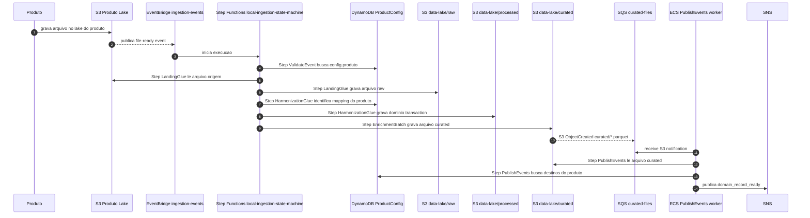

# POC Data Ingestion Pipeline

POC local de pipeline generica para ingestao de dados, seguindo ` project-context.md`.

## Ideia

Produtos gravam arquivos no lake deles, em S3. Quando um arquivo fica pronto, o produto publica um evento no EventBus. Esse evento inicia a Step Functions na nossa conta AWS. A pipeline copia o arquivo para `raw`, harmoniza para o dominio padrao `transaction`, salva em `processed`, enriquece para `curated` e publica eventos para consumidores via SNS. Registros invalidos ficam em `rejected` conforme threshold por produto e tambem seguem pelo fluxo S3 -> SQS -> ECS -> SNS.

Objetivo da POC:

- rodar local no MiniStack;
- usar servicos AWS emulados quando possivel;
- deixar variacao por produto fora do codigo, em DynamoDB + JSON de-para no S3;
- manter jobs genericos e simples;
- gerar evidencia clara de cada etapa.

## Desenho Draw.io

Arquivo de arquitetura: [IngestionPipeline.drawio](IngestionPipeline.drawio)

Abra no Draw.io/diagrams.net para ver a visao visual original. O README abaixo traduz essa ideia em Mermaid e no fluxo local executavel.

## Visao Geral

```mermaid
flowchart LR
    ProductS3[S3 Produto Lake<br/>arquivo pronto] --> ProductEvent[EventBridge<br/>file-ready event]
    ProductEvent --> SFN[Step Functions<br/>local-ingestion-state-machine]

    SFN --> Validate[Step: ValidateEvent<br/>DynamoDB ProductConfig]
    Validate --> Landing[Step: LandingGlue<br/>Glue Job]
    Landing --> Raw[S3 data-lake/raw]

    Raw --> Harmonization[Step: HarmonizationGlue<br/>Glue Job]
    Harmonization --> Processed[S3 data-lake/processed]

    Processed --> Enrichment[Step: EnrichmentBatch<br/>Batch/ECS task]
    Enrichment --> Curated[S3 data-lake/curated]
    Harmonization --> Rejected[S3 data-lake/rejected]

    Curated --> S3Notification[S3 ObjectCreated<br/>curated/*.parquet]
    Rejected --> RejectedNotification[S3 ObjectCreated<br/>rejected/*.jsonl]
    S3Notification --> CuratedQueue[SQS<br/>curated-files]
    RejectedNotification --> CuratedQueue
    CuratedQueue --> Publish[Step: PublishEvents<br/>ECS Worker]
    Publish --> SNS[SNS<br/>domain events]
    SNS --> DestQueues[SQS destino]
```



## Sequencia



## Arquitetura local

- `docker-compose.yml`: sobe MiniStack em `localhost:4566`.
- `pipeline.py`: publica eventos no EventBridge e faz bootstrap da infra local.
- `local_eventbridge_runner.py`: consome fila target do EventBridge e inicia execucao local da Step Functions.
- `local_sfn_runner.py`: le `state-machine.asl.json` e executa os jobs locais definidos no ASL.
- `glue_landing.py`, `glue_harmonization.py`, `enrichment_batch.py`: jobs locais equivalentes aos passos Glue/batch.
- `ecs_worker.py`: script Python que representa ECS batch; consome SQS gerado por S3 notification, le S3 `curated` ou `rejected`, busca destinos no DynamoDB e publica SNS.
- `e2e_test.py`: teste ponta a ponta local contra MiniStack.
- `config/products.json`: seed de DynamoDB com produto, dominio, destinos e `mapping_key`.
- `config/mappings/*.json`: de-para por produto para o dominio comum `transaction`.
- `samples/`: 3 arquivos e 3 eventos. `orders` e `payments` processam para o mesmo dominio `transaction`; `invoices` pula porque nao existe no DynamoDB.

O fluxo preserva a arquitetura alvo:

`EventBus -> Step Functions -> Glue landing -> /raw -> Glue harmonizacao -> /processed -> batch enrichment -> /curated -> S3 notification -> SQS -> ECS -> SNS`

Na POC local, MiniStack emula os servicos AWS possiveis. Glue/ECS sao scripts Python locais. EventBridge entrega em uma fila target local e `local_eventbridge_runner.py` aciona o runner da Step Functions. A sequencia de steps vem do `state-machine.asl.json`; `pipeline.py` nao chama jobs diretamente.

## Setup

Crie venv e instale dependencias:

```bash
python3 -m venv .venv
. .venv/bin/activate
pip install -r requirements.txt
```

Suba MiniStack:

```bash
docker compose up -d
```

Crie buckets, filas, S3 notification, EventBridge rule/target, Step Functions, DynamoDB e suba arquivos/de-para exemplo:

```bash
python3 pipeline.py --bootstrap
```

## Rodar ponta a ponta

Publicar todos os eventos exemplo no EventBridge:

```bash
python3 pipeline.py
```

Executar runner local do EventBridge/Step Functions:

```bash
python3 local_eventbridge_runner.py
```

Saida do runner mostra evidência rápida por execução:

```text
Pipeline summary: processed=2 skipped=1

Run: 20260501210000-db070cc9 | product=orders | file=orders-2026-05-01.csv | status=OK

STATUS  STEP                       DETAIL
------  -------------------------  ------------------------------------------------------------
OK      StepFunctions              ASL execution started by local runner
OK      DynamoDBConfig             product config found
OK      LandingGlue                copied 2 rows to raw
OK      HarmonizationGlue          loaded s3://data-lake/de-para/orders-transaction.json; mapped 2 rows to transaction domain
OK      EnrichmentBatch            enriched 2 rows
OK      S3Notification             curated object should notify SQS
OK      Manifest                   manifest persisted

Evidence: runtime/reports/20260501210000-db070cc9.json
```

Evidência completa fica em `runtime/reports/<run_id>.json`.

Executar worker ECS local:

```bash
python3 ecs_worker.py
```

Fluxo completo manual:

```bash
python3 pipeline.py --bootstrap
python3 pipeline.py
python3 local_eventbridge_runner.py
python3 ecs_worker.py
```

Validar E2E completo:

```bash
python3 e2e_test.py
```

Resultado esperado do E2E:

- 2 arquivos processados: `orders`, `payments`.
- 1 arquivo ignorado: `invoices`, produto sem config no DynamoDB.
- Ambos produtos configurados harmonizam para o mesmo dominio `transaction`.
- Cada produto usa evento/arquivo diferente e JSON de-para proprio.
- 2 objetos em `raw/`, 2 em `processed/`, 2 em `curated/`.
- S3 notification publica 2 mensagens na fila `curated-files`.
- ECS worker consome 2 notificacoes S3 da fila `curated-files`.
- SNS publica eventos para filas `billing-events`, `analytics-events`.

## Recursos MiniStack

- S3 buckets: `product-lake`, `data-lake`.
- De-para JSON: `s3://data-lake/de-para/*.json`.
- DynamoDB table: `ProductConfig`.
- EventBridge bus: `ingestion-events`.
- EventBridge rule target: SQS `eventbridge-file-ready`.
- Step Functions: `local-ingestion-state-machine`.
- ASL local: `state-machine.asl.json`.
- S3 notification: `data-lake` prefix `curated/` suffix `.parquet` -> SQS `curated-files`.
- S3 notification: `data-lake` prefix `rejected/` suffix `.jsonl` -> SQS `curated-files`.
- SQS: `curated-files`, filas destino criadas pelo worker.
- SNS: topicos destino criados pelo worker.

## Mapeamento por Produto

DynamoDB guarda qual de-para usar:

```json
{
  "product": "orders",
  "domain": "transaction",
  "mapping_key": "de-para/orders-transaction.json",
  "publish": {
    "destinations": ["billing-events", "analytics-events"]
  },
  "rejection_policy": {
    "max_error_percent": 1,
    "max_error_count": 1000,
    "destinations": ["data-quality-events"]
  }
}
```

S3 guarda o JSON de-para:

```json
{
  "domain": "transaction",
  "domain_required_fields": [
    "transaction_id",
    "customer_id",
    "amount",
    "transaction_date"
  ],
  "layout_mapping": {
    "pedido_id": "transaction_id",
    "cliente_id": "customer_id",
    "valor_total": "amount",
    "data_pedido": "transaction_date"
  }
}
```

Outro produto pode ter colunas origem diferentes, mas precisa mapear para o mesmo dominio `transaction`.

## Registros rejeitados

Campos obrigatorios vazios na harmonizacao ou falhas por linha no enriquecimento nao bloqueiam o arquivo inteiro enquanto ficarem dentro do `rejection_policy` do produto. Linhas boas seguem para `processed` e `curated`; linhas ruins sao gravadas em `rejected/<stage>/<product>/.../<run_id>/*.jsonl`.

Se rejeicoes em qualquer etapa passarem de `max_error_percent` ou `max_error_count`, a execucao falha e nao grava a pasta da proxima etapa (`processed` na harmonizacao, `curated` no enriquecimento). A falha publica evento `ingestion.file-failed`. Arquivos `rejected/*.jsonl` geram notificacao S3 para a mesma SQS do worker; o ECS publica `ingestion.records-rejected` no SNS configurado em `rejection_policy.destinations`.

## Testes

Unitarios sem MiniStack:

```bash
python3 -m unittest discover -s tests
```

E2E com MiniStack:

```bash
python3 e2e_test.py
```

O E2E também grava relatório em `runtime/reports/e2e-<timestamp>.json`, com cada checagem executada.

## Novo produto

1. Adicione config em `config/products.json`.
2. Crie JSON de-para em `config/mappings/<produto>-transaction.json`.
3. Garanta que o mapping cobre todas as colunas padrão do dominio `transaction`.
4. Rode `python3 pipeline.py --bootstrap` para semear DynamoDB e subir de-para no S3 antes da pipeline.
5. Suba arquivo em `samples/product-lake/<produto>/<arquivo>.csv`.
6. Envie evento com `product`, `file_name`, `business_date`.

Sem deduplicacao central: se produto reenviar mesmo `ano/mes/dia`, pipeline processa novo `run_id`.

## Nota POC

O arquivo `.parquet` local e JSON Lines com extensao `.parquet`, para manter fluxo e nomes do lake sem adicionar `pyarrow` nesta POC. Em AWS real, etapa Glue troca escrita local por Parquet real.

MiniStack emula EventBridge, SQS, S3, DynamoDB, SNS e Step Functions. O runner local existe apenas porque os jobs Glue/batch sao scripts Python locais nesta POC. A sequencia vem de `state-machine.asl.json`, nao de chamadas hardcoded em `pipeline.py`.
